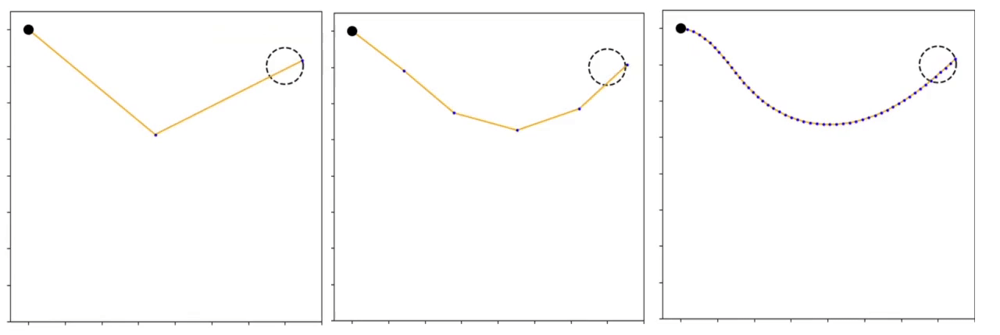

# Planar Robot
2D robotic arm with arbitrary number of links and rotational joints.

Implementation of trajectory planning and kinematic control.

## Examples
Real-time visualization of kinematic control while the end-effector follows a path [(notebook)](https://github.com/tsitsimis/planar-robot/blob/master/notebooks/Trajectory%20Planning.ipynb).



## Dependencies
* numpy
* matplotlib

## Use
```python
from planarobot.planar_arm import PlanarArm  

links = np.array([2, 1, 1])  # lengths of links  
robot = PlanarArm(links)  

...
```
